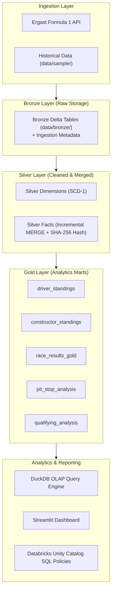

# Formula 1 Enterprise Lakehouse Pipeline


An enterprise-grade, zero-cost Medallion Architecture (Bronze → Silver → Gold) Data Engineering Lakehouse for Formula 1 racing telemetry and historical data.

The project mirrors an **Azure Data Factory + Databricks + Unity Catalog + Power BI** reference architecture while executing 100% locally with open-source technologies.

---

## 🏗️ Architecture Overview



---

## 🏛️ Local Mode vs. Azure Cloud Architecture Mapping

| Component | Local Open-Source Equivalent | Enterprise Azure Cloud Target |
| :--- | :--- | :--- |
| **Storage Layer** | Local Filesystem / MinIO S3 Layout (`data/`) | Azure Data Lake Storage Gen2 (`abfss://`) |
| **Compute Engine** | PySpark 3.5.1 + OpenJDK 17 + Python 3.11 | Azure Databricks Multi-Node Cluster |
| **Table Format** | Delta Lake 3.2.0 (ACID Log, Checkpoints) | Delta Lake on Databricks Runtime |
| **Orchestration** | Python Orchestrator (`pipeline.py`) + Airflow DAG | Azure Data Factory (ADF) Pipelines |
| **Governance** | Local Catalog + `sql/governance.sql` | Databricks Unity Catalog (3-Level Namespace) |
| **Security & Secrets** | Service Principal simulator + `.env` provider | Microsoft Entra ID + Key Vault Secret Scopes |
| **BI & Analytics** | Streamlit + Plotly + DuckDB | Power BI Service DirectLake / Databricks SQL |

---

## 📊 Formats & Datasets

| Dataset | Tier | Source Format | Key Transformation Highlights |
| :--- | :--- | :--- | :--- |
| **`circuits`** | Dimension | CSV | Type casting (lat/lng/alt), column renaming to snake_case |
| **`races`** | Dimension | CSV | Combines `date` + `time` into unified `race_timestamp` |
| **`constructors`**| Dimension | Single-line JSON | Standardizes team references and nationality |
| **`drivers`** | Dimension | Nested JSON | Flattens `name.forename` & `name.surname` into `full_name` |
| **`results`** | Fact | Single-line JSON | Computes `record_hash` (SHA-256) for MERGE upserts |
| **`pitstops`** | Fact | Multi-line JSON | Aggregates pit stop duration and lap timing |
| **`laptimes`** | Fact | Split CSV Files | Merges multi-part CSVs, tracks lap position deltas |
| **`qualifying`** | Fact | Split Multi-line JSON | Merges multi-part JSONs, tracks Q1/Q2/Q3 progression |

---

## 🚀 Quick Start Guide

### Prerequisites
- Python 3.11+
- OpenJDK 17 (`java -version` returning Java 17)

### 1. Environment Setup
```bash
# Create virtual environment
python3.11 -m venv .venv
source .venv/bin/activate  # Linux/macOS
# .venv\Scripts\activate   # Windows PowerShell

# Install dependencies
pip install -r requirements.txt

# Copy environment template
cp .env.example .env
```

### 2. Generate Sample Datasets
```bash
python generate_sample_data.py
```

### 3. Run Pipeline Stages
```bash
# Run complete pipeline end-to-end (Bronze -> Silver MERGE -> Gold Marts -> Data Quality)
python orchestration/pipeline.py --stage all

# Run deterministic historical backfill
python orchestration/backfill.py --start-year 2021 --end-year 2022
```

### 4. Run Test Suite
```bash
pytest tests/ -v
```

### 5. Launch Analytics Dashboard
```bash
streamlit run dashboard/app.py
```

---

## 🛡️ Governance & Security Highlights
- **Incremental MERGE Audit Trail**: `create_date` is preserved on initial insertion while `update_date` updates upon modification.
- **Unity Catalog SQL (`sql/governance.sql`)**: 3-level namespace definitions (`formula1_catalog.gold.driver_standings`), dynamic column masking for PII (`driver_dob_mask`), and RBAC grants.
- **Great Expectations Quality Suite**: Automated non-null, primary key uniqueness, foreign key referential integrity, and value range checks.
# f1_azure
