# Formula 1 Lakehouse Pipeline - Medallion Architecture Specification

## Overview
This document specifies the enterprise **Bronze → Silver → Gold Medallion Architecture** for the Formula 1 Lakehouse Data Pipeline.

```mermaid
flowchart TD
    subgraph Source["Data Ingestion Source"]
        API["Ergast Formula 1 API"]
        LocalData["Local Historical Datasets (data/sample/)"]
    end

    subgraph Bronze["Bronze Layer (Raw Delta Lake)"]
        B_Circuits["circuits (Delta)"]
        B_Races["races (Delta)"]
        B_Constructors["constructors (Delta)"]
        B_Drivers["drivers (Delta)"]
        B_Results["results (Delta)"]
        B_Pitstops["pitstops (Delta)"]
        B_Laptimes["laptimes (Delta)"]
        B_Qualifying["qualifying (Delta)"]
    end

    subgraph Silver["Silver Layer (Cleaned & Merged Delta Lake)"]
        S_Circuits["circuits (SCD-1)"]
        S_Races["races (SCD-1)"]
        S_Constructors["constructors (SCD-1)"]
        S_Drivers["drivers (SCD-1)"]
        S_Results["results (Incremental MERGE)"]
        S_Pitstops["pitstops (Incremental MERGE)"]
        S_Laptimes["laptimes (Incremental MERGE)"]
        S_Qualifying["qualifying (Incremental MERGE)"]
    end

    subgraph Gold["Gold Layer (Analytical Marts & Dimensional Models)"]
        G_DriverStandings["driver_standings"]
        G_ConstructorStandings["constructor_standings"]
        G_ResultsGold["race_results_gold"]
        G_PitStopAnalysis["pit_stop_analysis"]
        G_QualifyingAnalysis["qualifying_analysis"]
    end

    subgraph Serving["Analytics & Governance"]
        Dashboard["Streamlit Interactive Dashboard"]
        DuckDB["DuckDB OLAP Engine"]
        UnityCatalog["Databricks Unity Catalog SQL Policies"]
    end

    Source --> Bronze
    Bronze --> Silver
    Silver --> Gold
    Gold --> Serving
```

---

## Tier Definitions

### 1. Bronze Layer (Raw Storage Tier)
- **Purpose**: Preserves raw source records in native structures while enforcing Delta Lake ACID semantics.
- **Formats Handled**:
  - `circuits`: CSV
  - `races`: CSV
  - `constructors`: Single-line JSON
  - `drivers`: Nested JSON
  - `results`: Single-line JSON
  - `pitstops`: Multi-line JSON
  - `laptimes`: Multi-file split CSVs
  - `qualifying`: Multi-file split JSONs
- **Audit Columns**: `ingestion_date` (`TIMESTAMP`), `input_file_name` (`STRING`), `source_system` (`STRING`).

### 2. Silver Layer (Cleaned & Merged Storage Tier)
- **Purpose**: Standardized, schema-cast, deduplicated, and enriched single-source-of-truth Delta tables.
- **Dimension Strategy**: Full reload / SCD Type 1 upsert with primary key matching.
- **Fact Strategy**: Incremental Delta `MERGE` keyed on business primary keys with `record_hash` (SHA-256) change detection.
- **Audit Columns**: Preserves `create_date` from initial insertion and updates `update_date` upon record modification.

### 3. Gold Layer (Curated Business Analytics Tier)
- **Purpose**: High-performance star-schema dimensional models and pre-aggregated analytics marts for business intelligence (Streamlit / Power BI) and Machine Learning.
- **Core Marts**:
  - `driver_standings`: Season championship points, wins, podiums, and official FIA rank.
  - `constructor_standings`: Team championship aggregates.
  - `race_results_gold`: Denormalized star-schema race telemetry.
  - `pit_stop_analysis`: Team pit stop strategy and duration performance.
  - `qualifying_analysis`: Grid vs. finish movement and qualifying pace deltas.
