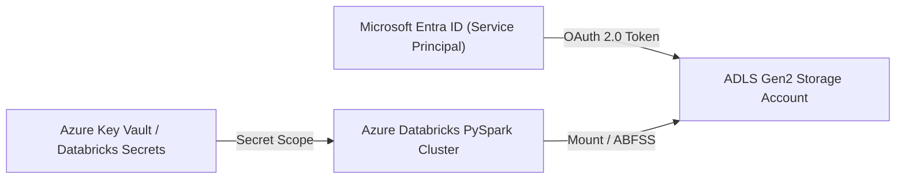

# Enterprise Security & Credentials Architecture

## Security Reference Model

## Local Mode Security Equivalents
- **Secrets Management**: Abstracted `SecretsManager` (`src/utils/secrets.py`) reads credentials from environment variables or `.env`.
- **Service Principal Simulation**: Maps `AZURE_CLIENT_ID`, `AZURE_CLIENT_SECRET`, and `AZURE_TENANT_ID` for cloud deployment testing.
- **Data Credential Masking**: Loggers redact secret tokens before writing output.
